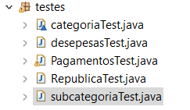

<h1 style="text-align: center;">Gererenciador de Pagamentos de República Universitária</h1>

<h3 style="text-align: center;">Projeto Final da Disciplina de Orientação a Objetos</h3>

<h5 style="text-align: left;">Turma: A - 1.2021 - Professor: Dr. André Luiz Peron Martins Lanna</h5>

<h4 style="text-align: center;">Universidade de Brasília 
</h4 >

## Integrantes
- Davi Matheus Garcia Pedroza - 160070040
- Genilson Silva de Araújo - 202045482
- Iago Carvalho Cavalcante - 180018621
- Jhonathan Nicolas Moreira Silva - 160031621
- Luan Vasco Cavalcante - 190111836
- Pedro Henrique Yamaguti - 190094508

## Features

- Cadastro de Residentes
- Cadastro de Categorias e subcategorias
- Cadastro de despesas
- Tratamento de exceções para diversas situações
- Cálculo da dispersa por residente baseado no método igualitário e/ou proporcional.

O Gerenciador de pagamentos de república tem o interesse de ajudar o usuário a mapear despesas dentro da república universitária, informando suas categorias, subcategorias e quanto cada residente deve pagar ao final do mês considerando o método igualitário ou proporcional.

## UML

Link para a UML editável: 
>https://drive.google.com/file/d/13SuR3UysYN9rx-EQOwAMbz1r00mUBjDj/view?usp=sharing

 - PDF: https://github.com/Luan-Cavalcante/Projeto_OO/blob/master/UML.pdf 

## Exceções
>**CategoriaNaoInformadaException**: Trata casos onde a categoria não é informada no cadastro.

>**DataNaoInformadaException**: Trata casos onde a data não é informada no cadastro.

>**DescricaoNaoInformadaException**: Trata casos quando a descrição da categoria ou subcategoria não é informada.

>**ListadeResidentesVaziaException**: Trata casos quando o não é informado residentes no cadastro.

>**NroPagamentosDiferenteNroResidentesAException**: Trata casos quando o número de pagamentos(parcela por pessoa), por alguma razão é maior que o número de residentes.

>**DataInvalidaException**: Trata casos quando a data informada é invalida.

>**ValorNaoInformadoException**: Trata casos quando não é informado o valor das despesas.

>**RendimentoInvalidoException**: Trata casos quando é informado um valor inválido de rendimento.

>**DadosPessoaisIncompletosException**: Trata casos quando não é informado algum dos dados pessoais do residente.

## Funcionamento
>**Opção 1**: Ao rodar o programa, é inicializada uma interface com 5 opções de entrada, seguidas logo abaixo por uma tecla para confirmar e outra para cancelar. Na opção 1, será possível fazer o cadastro do Residente, coletando alguns dados como Nome, E-mail e o Valor.

>
>
>
>

>**Opção 2**: Na opção 2 é possível fazer o cadastro das despesas, que para ser completado necessita de dados como Mês de vencimento, Ano, Valor e o Credor da despesa. Em seguida já aparecerá uma lista das categorias para ser selecionada e ligá-la a despesa. Caso queira criar uma nova, também é possível, tendo também uma opção para subcategoria.

>
>
>
>
>
>
>
>

>**Opção 3**: A opção 3 é própria para cadastrar uma categoria separadamente, funcionando da mesma forma do cadastro anterior, tendo o cadastramento da categoria e a opção da subcategoria. 

>
>
>

>**Opção 4**: Na opção 4 os pagamentos são realizados. Logo após avançar, terá como opções o pagamento igualitário ou proporcional dos residentes, seguidas de uma opção para retornar a tela inicial. Nas duas primeiras opções, ao avançar será necessário digitar o Mês e Ano de vencimento da despesa questão. Por fim, aparecerá uma interface indicando os dados cadastrados do residente e a o valor a pagar separadamente por residente da despesa selecionada.

>
>
>
>
>
>
>
>

>**Opção 0**: A opção zero encerra o programa.

>

## Seção de testes
>**Testes**: Foi feita uma sessão apenas para testes que não deve ser considerada!

>